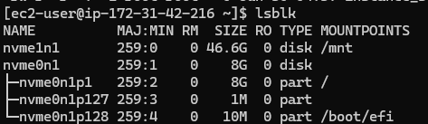
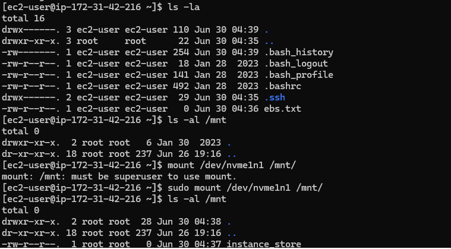
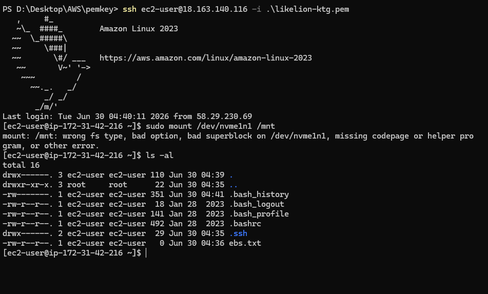
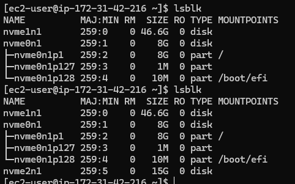

# EC2 Storage  

## EBS(Elastic Block Storage)
- **Isolated** storage that can be attached to an EC2 instance
- Generally, EBS is automatically created and attached when a new EC2 instance is created
- We can manually create EBS and attach it to an EC2
- **Availability Zone** must be set when we create EBS  
    &rightarrow; An EBS belongs to certain AZ
- Since EBS is isolated, the data inside it is preserved after rebooting or instance restart, even after it is detached from the instance

## Instance Store
- Storage allocated to an EC2 when we create it
- Not every type of EC2 instance can use instance store  
    &rightarrow; We need to search instance type that supports instance store
- Instance store is slightly faster than EBS
- The data inside it is preserved after rebooting
- The data inside it is **not preserved** after instance restart

## EBS & Instance Store Practice
- nvme0n1 - EBS / nvme1n1 - Instance Store  
    
- Before reboot  
    
- After reboot(Nothing changed)  
    
- After instance restart(since instance store is cleared, we need to reformat its file system)  
    
- Storage full is a critical issue for EC2 &rightarrow; Simply attache additional EBS  
    

## Thoughts
- Since both EBS and instance store is **block storage**, basically they need to be partioned and formatted  
    &rightarrow; During practice, instance store wasn't formatted, so I needed to format manually
- Honestly, EBS seems much more useful than instance store for me  
    &rightarrow; Eventhough, knowing difference between them is important