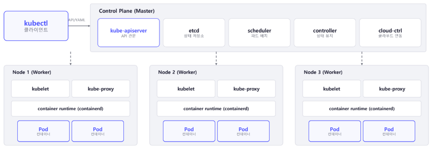

# Basic Concept

## Concept
- Multi-container orchestration platform
- Hierarchical architecture
    - kubectl
    - Control Plane &rightarrow; Master node
    - Data Plane &rightarrow; Worker node
- Pod is minimal unit, not container  
    - A pod is a group of containers
    - Containers in the same pod shares IP and ports / volume
    - Containers in the same pod communicate via localhost
    - IP address is 
- A master node makes work nodes to sustain pods
- Endures heavy traffic with auto scaling
- Zero-downtime deploy with rolling deploy
- IP addresses of pods are managed with DNS service
- **Declarative API**
    - Declare a target state of the cluster
    - The cluster keeps tracking current state and reconcile its state if needed
    - The cluster judges its state by API informations from nodes 

## Kubernetes Architecture

- Control plane
    - kube-apiserver  
    Every component of k8s communicates via API  
    &rightarrow; kubectl / controller / kubelet send API to this server
    - etcd  
    Save state of the cluster in key-value way
    - kube-scheduler  
    Allocate a pod to a proper worker nod
    - kube-controller-manager  
    Manage controllers that conconsile the cluster
- Data plane
    - kubelet  
    Send API information to control plane api server(status of the worker node)
    - kube-proxy  
    Manage iptables/ipvs of the worker node
    - container runtime(ex. containerd)

## Thought
- k8s has many components  
    &rightarrow; Which means a lot of things to check when we do troubleshooting
- I need to focus on it is divided in control plane and data plane  
    &rightarrow; What control plane does is keep reconciling!, it is not propoer to directly access the worker node and fix it when we do troubleshooting