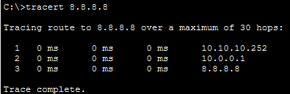

# Floating Static Routing
&nbsp;
## Concept
- We can route different routes as backup routes for the same network
- Backup route has **AD(Administrative Distanse)**
- Router choose a route that has a shorter(or 0) AD
- If the router cannot use that route, it choose alternative route
&nbsp;

## Configure
- Simply route alternative routes with AD
&nbsp;

## Packet Tracer Practice
- Before disaster
    
- After disaster
    .png)
    .png)
&nbsp;

## Thoughts
- Static routing can be used in the important part of the network and Floating static routing can be used to improve the durability/sustainability of the network
- We can consider this method when we have to put static routing on the network