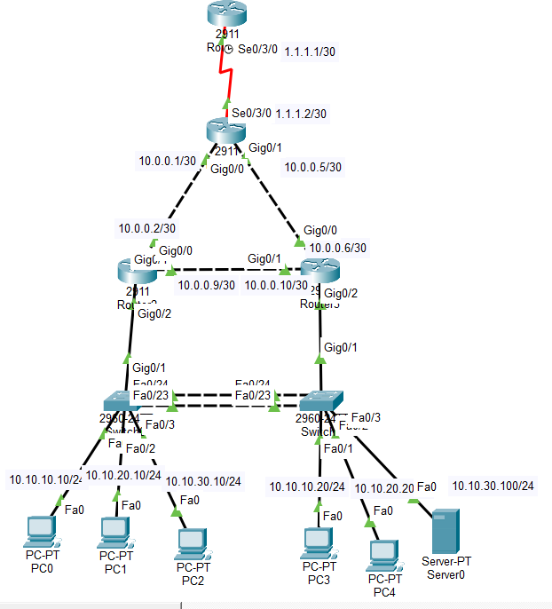
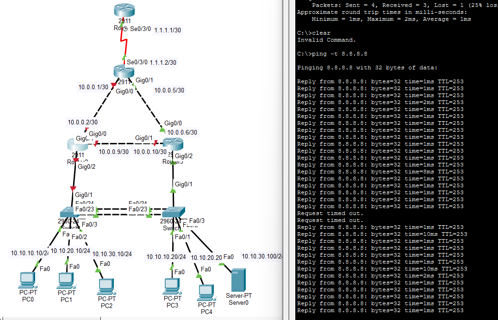
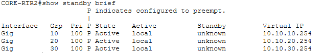
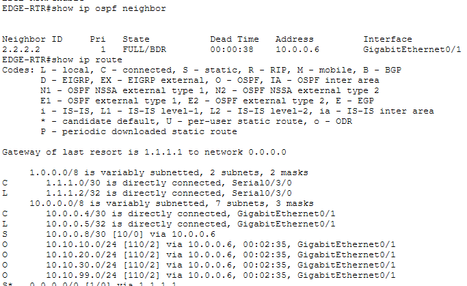

# Gateway Router Disaster Practice

## Topology

## Condition
- HSRP has been set
    -> CORE-RTR1(Router 2) is activated in peace time
- OSPF has been set
    -> EDGE-RTR(Router 1) is area gateway router of area 0(Whole subnet) 

## Failover
- Core-RTR1 is down
    
    -> As we can see, connection to the Internet quickly, automatically was recovered
- HSRP automatically activated CORE-RTR2(Router 3)
    
    -> CORE-RTR2 worked as a backup gateway router
- OSPF automatically rerouted area 0
    

## Thoughts
- HSRP + OSPF -> Come up with the backup router solution
- In failover situation, the network automatically recovers the situation
    -> Advantage of the backup router solution