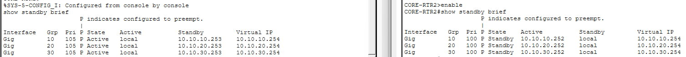
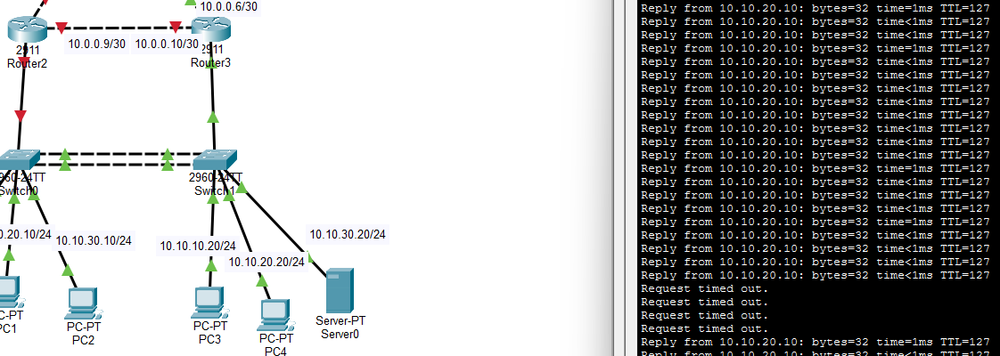
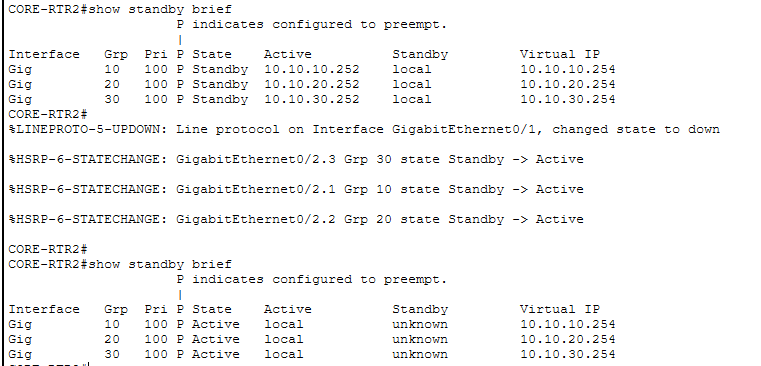

# HSRP(Hot Standby Router Protocol)
&nbsp;
## Concept

- Only Cisco devices support HSRP protocol
- Available to place 2 or more gateway router and make them work as single gateway router
    -> Bind 2 or more gateway router to single gateway router
- Automatically react to failover
- Binded routers share one virtual IP and MAC addr
    -> Becomes default gateway router addr of that network
- 1 router becomes **Active Router** and others become **Standby Router**
    - In peace time, Active Router takes all traffic
    - Active Router and Standby Routers keep exchanging hello packets
    - If Standby Router doesn't accept hello packet for specific time, Standby Router considers failover happens and takes the roll of Active Router
&nbsp;
## Configuration

- Each gateway router must have own ip address
- Available to set multiple standby ID in single router
- Configure each router's **Priority**
- **Preempt** option makes router automatically takes Active Router roll if failover happens
&nbsp;
## Packet Tracer Practice

- Before failover happens
    
- After failover happens
    - CORE_RTR1 shutdown
        

    - CORE_RTR2 takes the Active Router roll
        
&nbsp;
## Thoughts

- Should think that I can use this solution only to Cisco devices
- It improves the durability of the network
- The most impressive thing is that it automatically reacts to the failover